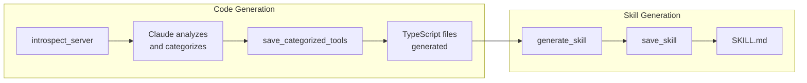

# mcp-server

[](https://github.com/bug-ops/mcp-execution/actions)
[](https://github.com/bug-ops/mcp-execution)
[](LICENSE)

MCP server for generating progressive loading TypeScript files. Achieves 98% token savings (30,000 → 500-1,500 tokens per tool) by leveraging Claude's natural language understanding for tool categorization.

## Features

- **5 MCP Tools**: Complete workflow from introspection to skill generation
- **No LLM API Required**: Claude (the conversation LLM) handles categorization
- **98% Token Savings**: Progressive loading pattern reduces context usage dramatically
- **Type-Safe**: Full TypeScript types generated from MCP JSON schemas
- **Session Management**: Automatic 30-minute session expiry with lazy cleanup

## Installation

This crate is part of the [mcp-execution](https://github.com/bug-ops/mcp-execution) workspace.

```bash
# Build from workspace root
cargo build --release -p mcp-server

# Binary will be at target/release/mcp-execution
```

## Usage

### Running the Server

```bash
# Direct execution
mcp-execution

# Or via cargo
cargo run -p mcp-server
```

### Claude Code Configuration

Add to `~/.config/claude/mcp.json`:

```json
{
  "mcpServers": {
    "mcp-execution": {
      "command": "mcp-execution"
    }
  }
}
```

### Programmatic Usage

```rust
use mcp_server::GeneratorService;
use rmcp::ServiceExt;
use rmcp::transport::stdio;

#[tokio::main]
async fn main() -> anyhow::Result<()> {
    let service = GeneratorService::new().serve(stdio()).await?;
    service.waiting().await?;
    Ok(())
}
```

## MCP Tools

### `introspect_server`

Connect to an MCP server and discover its tools.

```json
{
  "server_id": "github",
  "command": "npx",
  "args": ["-y", "@anthropic/mcp-server-github"],
  "env": { "GITHUB_TOKEN": "..." }
}
```

Returns tool metadata for Claude to categorize and a `session_id` for the next step.

### `save_categorized_tools`

Generate TypeScript files using Claude's categorization.

```json
{
  "session_id": "uuid-from-introspect",
  "categorized_tools": [
    {
      "name": "create_issue",
      "category": "issues",
      "keywords": "create,issue,new,bug",
      "short_description": "Create a new issue"
    }
  ]
}
```

### `list_generated_servers`

List all servers with generated progressive loading files.

```json
{
  "base_dir": "~/.claude/servers"
}
```

### `generate_skill`

Analyze generated files and return context for SKILL.md generation.

```json
{
  "server_id": "github",
  "skill_name": "github-progressive",
  "use_case_hints": ["repository management", "issue tracking"]
}
```

### `save_skill`

Save generated SKILL.md content to the filesystem.

```json
{
  "server_id": "github",
  "content": "---\nname: github\ndescription: ...\n---\n...",
  "overwrite": false
}
```

## Workflow



## Architecture

### Modules

| Module | Description |
|--------|-------------|
| `service` | MCP server implementation with tool handlers |
| `types` | Parameter and result types for all tools |
| `state` | Session state management with LRU cache |
| `skill` | SKILL.md generation context builder |

### Dependencies

- **rmcp** - Official Rust MCP SDK
- **mcp-core** - Foundation types and traits
- **mcp-codegen** - TypeScript code generation
- **mcp-files** - Virtual filesystem for output
- **mcp-introspector** - MCP server discovery

## Related Crates

This crate is part of the `mcp-execution` workspace:

- [`mcp-core`](../mcp-core) - Foundation types, traits, and error handling
- [`mcp-introspector`](../mcp-introspector) - MCP server analysis
- [`mcp-codegen`](../mcp-codegen) - TypeScript code generation
- [`mcp-files`](../mcp-files) - Virtual filesystem
- [`mcp-cli`](../mcp-cli) - Command-line interface

## MSRV Policy

Minimum Supported Rust Version: **1.89**

MSRV increases are considered minor version bumps.

## License

Licensed under either of:

- Apache License, Version 2.0 ([LICENSE-APACHE](../../LICENSE.md) or <http://www.apache.org/licenses/LICENSE-2.0>)
- MIT license ([LICENSE-MIT](../../LICENSE.md) or <http://opensource.org/licenses/MIT>)

at your option.
