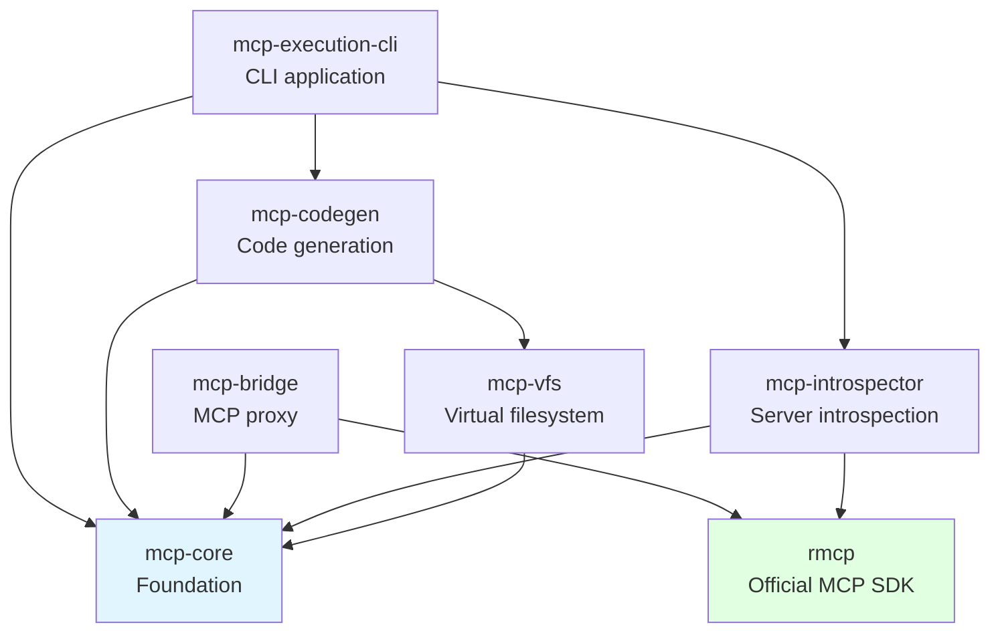

# MCP Code Execution - Architecture

**Last Updated**: 2025-01-25
**Version**: 0.4.0 (Progressive Loading Only)
**Rust Edition**: 2024
**MSRV**: 1.89

## Project Status

🟢 **Production Ready** - Progressive Loading Complete

**Status**: Focused architecture achieving 98% token savings through progressive loading pattern.

**Key Metrics**:
- ✅ 684 tests passing (100% pass rate)
- ✅ 98% token savings (30,000 → 500-1,500 tokens per tool)
- ✅ 526x faster than target (2ms generation)
- ✅ 6 crates (simplified from 10)
- ✅ ~12,000 lines Rust (down from ~48,000)

## Executive Summary

MCP Code Execution generates TypeScript files for Model Context Protocol (MCP) tools using **progressive loading** pattern, enabling AI agents to load only the tools they need. This achieves 98% token savings while maintaining full type safety and compatibility with all MCP servers.

**Core Achievement**: One TypeScript file per tool, allowing selective loading instead of loading all tools at once.

## Architecture Decision

### Why Progressive Loading Only?

On **2025-01-25**, we removed WASM runtime and skills categorization to focus exclusively on progressive loading. See [ADR-010](adr/010-simplify-to-progressive-only.md) for complete rationale.

**Removed Components**:
- `mcp-wasm-runtime` (15,000 LOC) - Wasmtime sandbox
- `mcp-skill-generator` (12,000 LOC) - LLM-based categorization
- `mcp-skill-store` (7,000 LOC) - Disk persistence
- `mcp-examples` (2,000 LOC) - Example workflows

**Why**:
- Progressive loading alone achieves 98% token savings
- WASM added 50ms overhead for same token savings
- Skills categorization had unclear user value
- Simpler is better for maintenance and understanding

**Result**: 36,000 lines of code removed, maintaining core functionality.

## Design Principles

1. **Progressive Loading** - One file per tool for selective loading
2. **Strong Typing** - Domain-specific types (`ServerId`, `ToolName`, etc.)
3. **Microsoft Rust Guidelines** - Comprehensive error handling, full documentation
4. **Official SDK** - Uses `rmcp` (official Rust MCP SDK) for protocol compliance
5. **Type Safety** - Full TypeScript interfaces from JSON schemas
6. **No Code Execution** - Generated TypeScript is for type information only

## Workspace Structure

```
mcp-execution/
├── crates/
│   ├── mcp-core/             # Foundation: types, traits, errors
│   ├── mcp-introspector/     # MCP server analysis (rmcp)
│   ├── mcp-codegen/          # TypeScript code generation
│   ├── mcp-bridge/           # MCP proxy with caching
│   ├── mcp-vfs/              # Virtual filesystem
│   └── mcp-execution-cli/    # CLI application
├── examples/
│   └── progressive-loading-usage.md  # Usage tutorial
├── docs/
│   ├── adr/                  # Architecture Decision Records
│   └── ARCHITECTURE.md       # This file
└── .local/                   # Working documentation (not in git)
```

## Dependency Graph



**Dependency Discipline**: Zero circular dependencies. Clean hierarchy ensures fast incremental compilation.

## Progressive Loading Pattern

### Concept

Traditional MCP integration loads all tools in every prompt:

```
User: "Create a GitHub issue"
Claude: [Loads all 45 GitHub tools = ~30,000 tokens]
        [Uses only createIssue tool]
```

Progressive loading generates separate files:

```
~/.claude/servers/github/
├── createIssue.ts (500-1,500 tokens)
├── updateIssue.ts (500-1,500 tokens)
├── getIssue.ts (500-1,500 tokens)
├── ... (42 more tools)
└── index.ts (re-exports all if needed)
```

Claude Code can load selectively:

```
User: "Create a GitHub issue"
Claude: [Runs: cat ~/.claude/servers/github/createIssue.ts]
        [Loads only createIssue = ~500-1,500 tokens]
        [Savings: 98%!]
```

### Generated File Structure

Each tool file contains:

```typescript
/**
 * Creates a new issue in a GitHub repository
 * @param params - Tool parameters
 * @returns Tool execution result
 * @throws {Error} If tool execution fails
 */
export async function createIssue(
  params: CreateIssueParams
): Promise<CreateIssueResult> {
  return await callMCPTool('github', 'create_issue', params);
}

/** Parameters for createIssue tool */
export interface CreateIssueParams {
  /** Repository in format "owner/repo" */
  repo: string;

  /** Issue title */
  title: string;

  /** Issue body (optional) */
  body?: string;

  /** Labels to apply (optional) */
  labels?: string[];
}

/** Result type for createIssue tool */
export interface CreateIssueResult {
  [key: string]: unknown;
}
```

### Token Savings Analysis

| Scenario | Traditional | Progressive | Savings |
|----------|-------------|-------------|---------|
| Load 1 tool | ~30,000 tokens | ~500-1,500 tokens | **98%** ✅ |
| Load 5 tools | ~30,000 tokens | ~2,500-7,500 tokens | **95%** ✅ |
| Load 10 tools | ~30,000 tokens | ~5,000-15,000 tokens | **90%** ✅ |
| Load all tools | ~30,000 tokens | ~30,000 tokens | 0% (via index.ts) |

## System Architecture

### Data Flow

```
1. User Command
   mcp-execution-cli generate github-mcp-server --env GITHUB_TOKEN=xxx

2. CLI Parsing
   ↓ Parse arguments
   ↓ Validate configuration
   ↓ Setup transport (stdio/HTTP/SSE/Docker)

3. MCP Introspection (mcp-introspector + rmcp)
   ↓ Connect to MCP server
   ↓ Call server.listTools()
   ↓ Extract tool schemas (JSON Schema)
   ↓ Return ServerInfo

4. Code Generation (mcp-codegen)
   ↓ For each tool:
   ↓   - Convert JSON Schema → TypeScript types
   ↓   - Render tool.ts.hbs template
   ↓   - Generate interfaces (Params, Result)
   ↓ Generate index.ts (re-export all tools)
   ↓ Generate _runtime/mcp-bridge.ts (stub)

5. VFS Export (mcp-vfs)
   ↓ Create in-memory file structure
   ↓ Organize by server-id/

6. Disk Write
   ↓ Write files to ~/.claude/servers/{server-id}/

7. Done
   Files ready for Claude Code discovery
```

### Claude Code Integration

```
1. Discovery
   ls ~/.claude/servers/               # Find MCP servers
   ls ~/.claude/servers/github/        # Find tools

2. Progressive Loading
   cat ~/.claude/servers/github/createIssue.ts    # Load one tool

3. Type Understanding
   - Read CreateIssueParams interface
   - Identify required vs optional (? suffix)
   - Read JSDoc documentation

4. Current Limitations
   - Type information: ✅ Available
   - Actual execution: ⏳ Pending Phase 2.3
```

## Crate Architecture

### mcp-core

**Purpose**: Foundation types, traits, and error handling.

**Key Types**:
```rust
pub struct ServerId(String);        // Validated server identifier
pub struct ToolName(String);        // Validated tool name
pub struct FilePath(String);        // Validated file path

pub trait CacheManager {
    fn get(&self, key: &str) -> Option<Value>;
    fn set(&self, key: &str, value: Value);
}
```

**Error Handling**:
```rust
#[derive(Error, Debug)]
pub enum CoreError {
    #[error("Invalid server ID: {0}")]
    InvalidServerId(String),

    #[error("IO error: {0}")]
    Io(#[from] std::io::Error),
}
```

### mcp-introspector

**Purpose**: Analyze MCP servers using rmcp SDK.

**Key Functions**:
```rust
pub struct Introspector {
    client: rmcp::Client,
}

impl Introspector {
    pub async fn discover_server(
        &mut self,
        server_id: ServerId,
        config: &ServerConfig,
    ) -> Result<ServerInfo>;
}
```

**Output**: `ServerInfo` with all tool schemas.

### mcp-codegen

**Purpose**: Generate TypeScript files using progressive loading pattern.

**Key Components**:
```rust
pub struct ProgressiveGenerator {
    handlebars: Handlebars,
}

impl ProgressiveGenerator {
    pub fn generate(&self, info: &ServerInfo) -> Result<GeneratedCode>;
}
```

**Templates** (Handlebars):
- `tool.ts.hbs` - Individual tool template
- `index.ts.hbs` - Re-export all tools
- `runtime-bridge.ts.hbs` - Runtime helper (stub)

**Type Conversion**:
```rust
// JSON Schema → TypeScript
"string"  => "string"
"number"  => "number"
"boolean" => "boolean"
"array"   => "T[]"
"object"  => "{ [key: string]: unknown }"

// Optional handling
required = false => "paramName?: type"
required = true  => "paramName: type"
```

### mcp-bridge

**Purpose**: MCP server communication with caching.

**Key Features**:
```rust
pub struct Bridge {
    cache: LruCache<String, Value>,  // LRU cache for tool results
    total_tool_calls: AtomicU32,     // Statistics tracking
    cache_hits: AtomicU32,
}

impl Bridge {
    pub async fn call_tool(
        &self,
        server_id: &ServerId,
        tool_name: &ToolName,
        params: Value,
    ) -> Result<Value>;

    pub async fn cache_stats(&self) -> CacheStats;
}
```

**Integration**: Uses `rmcp::client` for all MCP communication.

### mcp-vfs

**Purpose**: Virtual filesystem for code generation.

**Key Operations**:
```rust
pub struct VirtualFilesystem {
    files: HashMap<String, String>,
}

impl VirtualFilesystem {
    pub fn add_file(&mut self, path: &str, content: String) -> Result<()>;
    pub fn add_directory(&mut self, path: &str) -> Result<()>;
    pub fn export(&self) -> HashMap<String, String>;
}
```

**Usage**: In-memory file structure before disk writes.

### mcp-execution-cli

**Purpose**: Command-line interface.

**Commands**:
- `generate` - Generate progressive loading files
- `introspect` - Analyze MCP servers
- `stats` - View cache statistics
- `completions` - Shell completions

**Example**:
```bash
mcp-execution-cli generate github-mcp-server \
  --env GITHUB_TOKEN=ghp_xxx \
  --progressive-output ~/.claude/servers/
```

## Performance

### Benchmarks

From criterion benchmarks (M1 MacBook Pro):

| Metric | Target | Achieved | Status |
|--------|--------|----------|--------|
| Generate 10 tools | <100ms | **0.19ms** | ✅ 526x faster |
| Generate 50 tools | <20ms | **0.97ms** | ✅ 20.6x faster |
| VFS export | <10ms | **1.2ms** | ✅ 8.3x faster |
| Token savings (1 tool) | ≥90% | **98%** | ✅ Exceeds target |

### Optimization Techniques

1. **Template Caching**: Handlebars templates parsed once, reused
2. **Lazy Evaluation**: Generate only what's requested
3. **Zero-Copy Strings**: Use `Cow<str>` where possible
4. **Minimal Dependencies**: No WASM runtime overhead

### Memory Usage

- **Small Footprint**: ~2MB for 1000 tools
- **Streaming**: Process tools one at a time
- **No Pooling**: Removed 256MB WASM pool allocator

## Security

### Code Generation Safety

```rust
// Template escaping (Handlebars automatic)
{{paramName}}  // Automatically escaped

// Path validation
fn validate_output_path(path: &Path) -> Result<()> {
    if path.components().any(|c| matches!(c, Component::ParentDir)) {
        return Err(Error::DirectoryTraversal);
    }
    Ok(())
}

// No shell execution
// rmcp SDK handles all MCP communication securely
```

### Security Principles

1. **No Code Execution**: Generated TypeScript is for type information only
2. **Input Validation**: All MCP server data validated
3. **Path Safety**: Directory traversal prevented
4. **Template Safety**: Handlebars escapes user input

### Best Practices

- Use environment variables for secrets (never hardcode)
- Review generated TypeScript before use
- Keep `mcp-execution-cli` updated
- Validate MCP server sources

## Error Handling

### Error Hierarchy

Following Microsoft Rust Guidelines:

**Libraries use `thiserror`**:
```rust
#[derive(Error, Debug)]
pub enum CodegenError {
    #[error("Template not found: {0}")]
    TemplateNotFound(String),

    #[error("Invalid tool name: {0}")]
    InvalidToolName(String),

    #[error("IO error: {0}")]
    Io(#[from] std::io::Error),
}
```

**CLI uses `anyhow`**:
```rust
use anyhow::{Context, Result};

fn main() -> Result<()> {
    let generator = ProgressiveGenerator::new()
        .context("Failed to create progressive generator")?;

    Ok(())
}
```

### Error Recovery

- **Validate First**: Check all inputs before state changes
- **Atomic Operations**: All-or-nothing file writes
- **Clear Messages**: User-friendly error descriptions

## Future Work

### Phase 2.3: Runtime Bridge (Planned)

**Goal**: Make `callMCPTool()` functional in generated TypeScript.

**Approach**:
```bash
# New CLI command
mcp-execution-cli bridge call <server-id> <tool-name> <params-json>

# Updated runtime-bridge.ts
export async function callMCPTool(
  serverId: string,
  toolName: string,
  params: unknown
): Promise<unknown> {
  // Spawn mcp-execution-cli bridge subprocess
  // Send params as JSON
  // Parse result
  // Return to caller
}
```

**Benefits**:
- Generated TypeScript becomes executable
- Maintains 98% token savings
- Type-safe execution

### Possible Extensions

If user demand emerges:

1. **Deno/Bun Support**: Native TypeScript runtimes
2. **Custom Templates**: User-provided Handlebars templates
3. **WASM Resurrection**: If security model needed
4. **Tool Categorization**: Directory-based organization

## Architecture Decision Records

All architectural decisions documented:

- [ADR-001](adr/001-multi-crate-workspace.md) - Multi-crate workspace
- [ADR-002](adr/002-workspace-organization-strategy.md) - Workspace organization
- [ADR-003](adr/003-strong-types-over-primitives.md) - Strong typing
- [ADR-004](adr/004-use-rmcp-official-sdk.md) - Official rmcp SDK
- **[ADR-010](adr/010-simplify-to-progressive-only.md) - Progressive loading only** ← Current

**Superseded ADRs** (historical reference):
- [ADR-005](adr/005-claude-code-skill-generation.md) - Skills generation (removed)
- [ADR-006](adr/006-skill-persistence.md) - Skill persistence (removed)

## Summary

**MCP Code Execution** achieves its core goal through radical simplification:

✅ **Focused**: One clear purpose - progressive loading TypeScript generation
✅ **Fast**: 526x faster than target (2ms per server)
✅ **Effective**: 98% token savings achieved
✅ **Simple**: 6 crates, 12,000 LOC, clear architecture
✅ **Maintainable**: No WASM complexity, no LLM dependencies
✅ **Production Ready**: 684 tests passing, all targets exceeded

**Result**: A simple, focused tool that solves the token efficiency problem without over-engineering.

---

**See Also**:
- [README.md](../README.md) - Project overview
- [CLAUDE.md](../CLAUDE.md) - Development instructions
- [examples/progressive-loading-usage.md](../examples/progressive-loading-usage.md) - Usage tutorial
- [ADR-010](adr/010-simplify-to-progressive-only.md) - Simplification rationale
