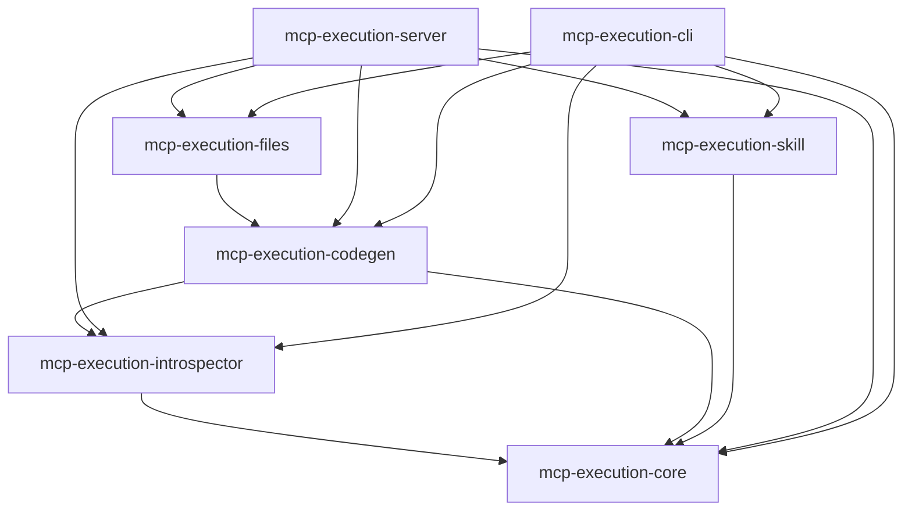

---
aliases:
  - Specifications Index
  - mcp-execution Specs Overview
  - MOC-specs
tags:
  - moc
  - sdd
created: 2026-07-27
status: moc
related:
  - "[[constitution]]"
  - "[[BRD-mcp-execution-2026-07-27]]"
  - "[[SRS-mcp-execution-2026-07-27]]"
  - "[[NFR-mcp-execution-2026-07-27]]"
---

# mcp-execution — Specification Package

> [!abstract]
> This is a **reverse-engineering documentation pass** over the existing
> `mcp-execution` codebase (not a design for a new feature). Every claim
> below was verified against the actual source in this worktree
> (`crates/*`), not paraphrased from `CLAUDE.md`. Where `CLAUDE.md`'s
> summary and the real code disagree, it is called out explicitly in
> [[#Discrepancies vs CLAUDE.md]].
>
> Business and formal requirements documents — [[BRD-mcp-execution-2026-07-27|BRD]],
> [[SRS-mcp-execution-2026-07-27|SRS]], [[NFR-mcp-execution-2026-07-27|NFR]] —
> are also reverse-engineered (from `README.md`, `CHANGELOG.md`, `Cargo.toml`,
> and the per-crate specs below), not authored ahead of implementation. They
> explicitly flag what genuinely cannot be grounded this way (market
> validation, named business stakeholders, a reconciled token-savings figure)
> rather than inventing it — see each document's own "Open Questions".

## What This Project Does

**mcp-execution** generates TypeScript code from MCP (Model Context
Protocol) server tool definitions using a *progressive loading* pattern —
one file per tool — so Claude Code loads only the tools it actually needs
(~500-1,500 tokens/tool) instead of an entire server's tool manifest
upfront (~30,000 tokens), a 93-98% token-budget reduction. It also exposes
that same generation capability *as an MCP server itself*, letting Claude
Code drive tool categorization with its own natural-language understanding
instead of a second LLM call, and it can render Claude Code `SKILL.md`
integration files from a server's already-generated tools.

## Business & Requirements Documents

| Document | Standard | Scope |
|---|---|---|
| [[BRD-mcp-execution-2026-07-27\|BRD]] | — | Business goals, problem statement, target users, functional requirements (business-level), scope/boundaries, success criteria |
| [[SRS-mcp-execution-2026-07-27\|SRS]] | ISO/IEC/IEEE 29148:2018 | Formal `SHALL`-level functional requirements, traced to the per-crate specs below and to the BRD |
| [[NFR-mcp-execution-2026-07-27\|NFR]] | ISO/IEC 25010:2011 | Quality attributes (performance, reliability, security, maintainability, portability) with measurable, code-grounded targets |

## Block Structure

Seven functional blocks, one per workspace crate, matching the real
dependency graph (low → high, verified from `Cargo.toml`'s
`[workspace.dependencies]` and each crate's own `Cargo.toml`):



| Block | Crate / Path | Spec |
|---|---|---|
| Core types & security | `mcp-execution-core` (`crates/mcp-core`) | [[core/spec]] |
| Introspection | `mcp-execution-introspector` (`crates/mcp-introspector`) | [[introspector/spec]] |
| Codegen / templating | `mcp-execution-codegen` (`crates/mcp-codegen`) | [[codegen/spec]] |
| Virtual filesystem & export | `mcp-execution-files` (`crates/mcp-files`) | [[files/spec]] |
| Skill generation | `mcp-execution-skill` (`crates/mcp-skill`) | [[skill/spec]] |
| MCP server exposure | `mcp-execution-server` (`crates/mcp-server`) | [[server/spec]] |
| CLI | `mcp-execution-cli` (`crates/mcp-cli`) | [[cli/spec]] |

`mcp-server` and `mcp-cli` are **parallel front doors** onto the same lower
four crates (`introspector`/`codegen`/`files`/`skill`) — they do not depend
on each other, and neither is "more canonical" than the other. `mcp-server`
adds a session-based, cancellation-aware, LLM-categorization workflow;
`mcp-cli` is synchronous, scriptable, and (for `generate`) uncategorized by
default.

## End-to-End Data Flow

Two entry points converge on the same lower pipeline:

```
CLI (mcp-cli generate / introspect)          MCP client, e.g. Claude Code
        │                                              │
        ▼                                              ▼
resolve_server_config() [cli/common.rs]     introspect_server tool [server/service.rs]
        │  mcp.json OR --http/--sse/positional args    │  always builds a *stdio* ServerConfig
        ▼                                              ▼
              ServerConfig  (mcp-core: security-validated —
              shell metachars, forbidden env vars incl. NODE_OPTIONS/
              BASH_ENV/PYTHONPATH/..., URL scheme, header safety,
              size/count bounds, timeout bounds; Stdio OR Http OR Sse)
                              │
                              ▼
      Introspector::discover_server()  (mcp-introspector)
        — bounded stdio response-line decoder (4 MiB, WARN+drop on overflow)
        — OR Streamable HTTP/SSE transport (rmcp) — SSE bounded, JSON body unbounded (documented gap)
        — pages tools/list, bails out early past MAX_TOOL_COUNT (1000)
        — per-tool name/description/schema size bounds
                              │
                              ▼
                    ServerInfo { tools: Vec<ToolInfo> }
                              │
              ┌───────────────┴───────────────┐
              ▼ (mcp-cli: uncategorized)       ▼ (mcp-server: Claude-categorized via
     ProgressiveGenerator::generate()             save_categorized_tools)
              │                          ProgressiveGenerator::generate_with_categories()
              └───────────────┬───────────────┘
                              ▼
                    GeneratedCode { files: Vec<GeneratedFile> }
              (index.ts, {tool}.ts × N, _runtime/mcp-bridge.ts,
               package.json, tsconfig.json, _meta.json — 7 files for
               a 2-tool server; sanitized JSDoc/TS-literal injection
               defenses applied before Handlebars renders; bounded by
               MAX_GENERATED_FILES/MAX_GENERATED_BYTES, derived from
               mcp-introspector's own bounds)
                              │
                              ▼
     FilesBuilder::from_generated_code(code, base) (mcp-files)
        .build_and_export(base_dir)   [cli path, shared base_dir, per-group atomic]
        .build().export_to_filesystem(output_dir)  [server path, per-output-dir Mutex]
                              │
                              ▼
              ~/.claude/servers/{server-id}/  (staged in a sibling temp
              dir, published via atomic rename; age-gated stale-artifact
              sweep guards concurrent siblings)
                              │
                              ▼ (optional, either entry point)
      mcp-skill: scan_tools_directory() reads _meta.json (not the .ts
      source) → build_skill_context() (sanitizes every untrusted field,
      wraps LLM-facing prompt in <untrusted-data> boundary)
              │                                    │
   mcp-cli skill:                        mcp-server generate_skill/save_skill:
   render_skill_md() directly            returns prompt → Claude composes →
   (no LLM)                              save_skill confines + writes
              │                                    │
              └────────────────┬───────────────────┘
                                ▼
                 ~/.claude/skills/{server-id}/SKILL.md
```

## Cross-Block Contracts (the load-bearing ones)

1. **`ServerConfig` validation is enforced at construction, re-checked at
   the trust boundary.** `mcp-core::ServerConfigBuilder::build()` runs full
   security validation, but every consumer that might receive a
   `ServerConfig` from somewhere else (deserialized JSON, a struct literal)
   re-validates: `mcp-introspector::Introspector::discover_server` does it
   as defense in depth even though its own callers always go through the
   builder. See [[core/spec#Defense in depth]].

2. **Resource bounds cascade downward by value, not by independent
   choice.** `mcp-introspector::MAX_TOOL_COUNT`/`MAX_TOOL_NAME_LEN`/
   `MAX_TOOL_DESCRIPTION_LEN`/`MAX_SCHEMA_SIZE_BYTES` are the root inputs;
   `mcp-codegen::MAX_GENERATED_FILES`/`MAX_GENERATED_BYTES` and
   `mcp-files::MAX_EXPORT_FILES`/`MAX_EXPORT_BYTES` are literally *equal to*
   (or a documented multiple of) those roots, `mcp-server`'s
   `MAX_TOTAL_PENDING_BYTES` derives from the same roots again. This is a
   deliberate, tested invariant: data that already cleared a lower layer's
   bound must never be deterministically rejected by a higher layer for
   merely being "as large as the lower layer already allows."

3. **`_meta.json` is the wire contract between codegen and everything that
   reads tool metadata back.** Schema owned by `mcp-core::metadata`
   (`METADATA_SCHEMA_VERSION`), written by `mcp-codegen`, read by
   `mcp-skill::scan_tools_directory` — which **cross-checks it against the
   `.ts` files actually on disk** rather than trusting it blindly (a
   sidecar entry with no matching file is a hard error; a `.ts` file with
   no sidecar entry is a non-fatal, surfaced warning). This replaced a
   historical regex-based re-parse of generated TypeScript that could never
   recover parameter descriptions.

4. **Path confinement is duplicated intentionally, not accidentally,
   across `mcp-skill` and `mcp-server`**, sharing the same primitives
   (`mcp-core::{sanitize_path_for_error, validate_path_segment}`):
   `mcp-skill::resolve_skill_output_path` (a file target) and
   `mcp-server::output_dir::resolve_output_dir` (a directory target,
   deliberately not pre-created — the export layer publishes it atomically)
   both walk one path component at a time, reject a symlink at the
   `server_id` boundary outright (not merely "resolve and re-check"), and
   are only ever resolved fresh, immediately before the write they guard —
   never cached across a session's lifetime.

5. **Debug-redaction is a workspace-wide, hand-maintained discipline, not
   a `derive`.** Any type carrying env vars, HTTP headers, CLI args, or
   URLs implements `Debug` by hand using `mcp-core::redact`'s wrapper types,
   from `ServerConfig` itself up through `mcp-cli`'s `Commands` enum.
   `Serialize` is deliberately exempt (config persistence needs real
   values) — this asymmetry is documented at every layer that repeats it.

6. **The generated TypeScript runtime bridge re-derives its own security
   rules from the same Rust source of truth**, rendered via Handlebars at
   generation time (`BridgeContext::default()`), not hand-copied — so
   `FORBIDDEN_CHARS`/`FORBIDDEN_ENV_NAMES`/`FORBIDDEN_ENV_PREFIX`/
   `ENV_NAME_CHARSET_REGEX` and the DoS size/count ceilings
   (`MAX_ARG_COUNT` and siblings) in `_runtime/mcp-bridge.ts` cannot
   silently drift from `mcp-core::command`'s Rust constants (#471, #467).

7. **Prompt-injection defense is one primitive (`mcp-core::untrusted`), two
   independent call sites.** Both `mcp-skill` (SKILL.md body + LLM
   generation prompt) and `mcp-server` (`introspect_server`'s tool
   summaries returned to Claude) sanitize control characters/Markdown-
   structural line breaks and, for LLM-facing text specifically, wrap it in
   an explicit, unforgeable `<untrusted-data>` boundary.

## Discrepancies vs `CLAUDE.md`

`CLAUDE.md`'s crate table and data-flow diagram are directionally correct
but materially incomplete/stale in the following ways (verified against
the real source, not assumed):

- **Transport support is undocumented.** `CLAUDE.md`'s data-flow diagram
  only shows a stdio subprocess path (`ServerConfig (security-validated...)
  → Introspector::discover_server() — spawns server process`). The real
  `Transport` enum has three variants — `Stdio`, `Http`, `Sse` — and
  `mcp-introspector` implements a full Streamable HTTP client path
  alongside stdio. Neither `ServerConfig`'s HTTP/SSE fields (`url`,
  `headers`) nor the CLI's `--http`/`--sse` flags nor `mcp.json`'s
  `"type": "http"`/`"sse"` entries are mentioned anywhere in `CLAUDE.md`.
- **Forbidden-env-var list is stale.** `CLAUDE.md` states: *"no forbidden
  env vars: LD_PRELOAD, LD_LIBRARY_PATH, DYLD_*, PATH"*. The actual list
  (`mcp-core::command::FORBIDDEN_ENV_NAMES`) additionally includes
  `LD_AUDIT`, `NODE_OPTIONS`, `BASH_ENV`, `PYTHONPATH`, `PYTHONSTARTUP`,
  `RUBYOPT`, `PERL5OPT`, `JAVA_TOOL_OPTIONS` — an entire category
  (interpreter-hijack vectors, not just dynamic-linker/PATH) is omitted.
- **`mcp-execution-server`'s scope is undersold.** `CLAUDE.md` describes it
  only as *"MCP server exposing progressive loading as MCP tools."* The
  actual crate exposes **five** tools, not just progressive-loading
  generation: `introspect_server`, `save_categorized_tools`,
  `list_generated_servers`, **and** `generate_skill`/`save_skill` — the
  latter two duplicate `mcp-cli skill`'s functionality via the MCP-tool
  interface, letting Claude compose SKILL.md content itself rather than a
  template-only render. `CLAUDE.md` never mentions this crate's dependency
  on `mcp-execution-skill`.
- **Generated file set is incomplete.** `CLAUDE.md`'s example tree shows
  only `index.ts`, per-tool `.ts` files, and `_runtime/mcp-bridge.ts`. The
  real generator (`ProgressiveGenerator::generate_with_categories`) also
  always emits `package.json`, `tsconfig.json`, and a `_meta.json`
  structured-metadata sidecar — the latter is load-bearing (it's the
  contract `mcp-skill` reads instead of re-parsing TypeScript).
  `CLAUDE.md` says nothing about the required `npm install` post-generation
  step either, which `mcp-cli generate` itself surfaces as a hint.
- **Resource-exhaustion (CWE-400) hardening is entirely undocumented.**
  `CLAUDE.md` does not mention any of the tool-count/schema-size/file-
  count/byte/session-count/session-byte/request-concurrency bounds that
  are, by volume of doc comments and tests, the single most invested-in
  architectural concern in this codebase (see [[constitution#V. Security]]).
- **Prompt-injection defense (`mcp-core::untrusted`) is undocumented.**
  Not mentioned in `CLAUDE.md` at all, despite being a dedicated module
  used by two separate crates specifically to prevent an introspected MCP
  server's self-reported metadata from smuggling Markdown structure or LLM
  instructions into Claude-facing text.
- **Atomicity/concurrency guarantees of the export path are undocumented.**
  `CLAUDE.md`'s data flow ends at `FileSystem::export()` as if it were a
  simple write. The real implementation is a staged-directory-then-atomic-
  rename with an age-gated stale-artifact sweep and per-resource locking at
  the `mcp-server` layer — deliberate engineering against a documented
  historical data-loss race, none of which is mentioned.

None of these are contradictions of what `CLAUDE.md` says — they are gaps
where the real system does materially more, or differently, than the
summary implies. Anyone extending this project via `CLAUDE.md` alone would
be unaware of HTTP/SSE transport, the fuller forbidden-env-var list, the
`generate_skill`/`save_skill` tools, `_meta.json`, or any of the
resource/prompt-injection hardening.

## See Also

- [[constitution]] — principles observed across every block
- [[core/spec]] — read this first; every other block depends on it
- [[BRD-mcp-execution-2026-07-27]] — business requirements (reverse-engineered)
- [[SRS-mcp-execution-2026-07-27]] — formal functional requirements
- [[NFR-mcp-execution-2026-07-27]] — formal non-functional/quality requirements
