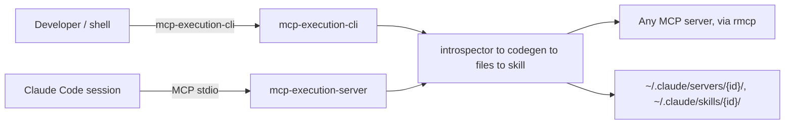

---
aliases:
  - mcp-execution SRS
  - mcp-execution Functional Spec
tags:
  - srs
  - requirements/functional
  - mcp
  - codegen
  - status/draft
created: 2026-07-27
project: "mcp-execution"
status: draft
standard: "ISO/IEC/IEEE 29148:2018"
related:
  - "[[BRD-mcp-execution-2026-07-27]]"
  - "[[NFR-mcp-execution-2026-07-27]]"
  - "[[README]]"
---

# mcp-execution: Software Requirements Specification

> [!abstract]
> Functional requirements specification for **mcp-execution**, workspace
> version `0.8.0`. Based on ISO/IEC/IEEE 29148:2018. Traceable to
> [[BRD-mcp-execution-2026-07-27]]. This is a **formal restatement** of
> behavior already implemented and already informally documented in
> `specs/core/spec.md`, `specs/introspector/spec.md`, `specs/codegen/spec.md`,
> `specs/files/spec.md`, `specs/skill/spec.md`, `specs/server/spec.md`, and
> `specs/cli/spec.md` — every `SHALL` statement below traces to a concrete,
> already-tested code path cited in one of those documents, not to a new
> design decision.

## 1. Introduction

### 1.1 Purpose

This SRS specifies, in verifiable `SHALL`/`SHOULD`/`MAY` form, the functional
behavior of the `mcp-execution` workspace: its CLI binary
(`mcp-execution-cli`), its MCP server binary (`mcp-execution-server`), and the
five library crates behind both (`mcp-execution-core`, `-introspector`,
`-codegen`, `-files`, `-skill`). Its intended audience is any developer or
coding agent extending, auditing, or re-implementing part of this system, and
any reviewer verifying that documented business requirements are actually
implemented.

### 1.2 Scope

`mcp-execution` converts MCP server tool definitions into self-contained,
per-tool TypeScript files (the "progressive loading" pattern) and generates
Claude Code `SKILL.md` integration files from the result. It does **not**
execute the generated TypeScript itself (that runs externally via Node.js/
`tsx`/`deno`), does not provide its own LLM API integration, and does not
sandbox the commands it is configured to spawn (see
[[BRD-mcp-execution-2026-07-27#Out of Scope]]). Full business rationale is in
[[BRD-mcp-execution-2026-07-27]].

### 1.3 Definitions, Acronyms, and Abbreviations

| Term | Definition |
|------|-----------|
| MCP | Model Context Protocol |
| VFS | Virtual filesystem (`mcp-execution-files`'s in-memory staging structure) |
| TS | TypeScript |
| CWE-400 | Common Weakness Enumeration 400, Uncontrolled Resource Consumption |
| Stdio transport | An MCP server reached by spawning a local subprocess and speaking JSON-RPC over its stdin/stdout |
| HTTP/SSE transport | An MCP server reached over a Streamable HTTP or Server-Sent Events endpoint |
| `_meta.json` | The structured metadata sidecar defined by `mcp_execution_core::metadata`, produced by codegen, consumed by skill generation |
| Session | A `mcp-execution-server` in-memory record (`PendingGeneration`) bridging `introspect_server` and `save_categorized_tools` |

### 1.4 References

- [[BRD-mcp-execution-2026-07-27]] — Business Requirements Document
- [[NFR-mcp-execution-2026-07-27]] — Non-Functional Requirements Specification
- [[README]] — cross-block architecture, data flow, and discrepancies vs. `CLAUDE.md`
- [[constitution]] — reverse-engineered project principles
- `specs/core/spec.md`, `specs/introspector/spec.md`, `specs/codegen/spec.md`, `specs/files/spec.md`, `specs/skill/spec.md`, `specs/server/spec.md`, `specs/cli/spec.md` — the per-crate informal specs this SRS formalizes

### 1.5 Document Overview

Section 2 describes the product in context (interfaces, user classes,
environment). Section 3 states the formal requirements, grouped by the same
seven feature areas as the BRD. Section 4 defines verification methods.
Section 5 (Appendices) provides the BRD↔SRS↔NFR traceability matrix.

## 2. Overall Description

### 2.1 Product Perspective

> [!info] System Context
> `mcp-execution` sits between an MCP server (any implementation, reached via
> the official `rmcp` SDK) and Claude Code's local filesystem
> (`~/.claude/mcp.json`, `~/.claude/servers/`, `~/.claude/skills/`). It is
> invoked either directly by a developer (CLI) or by a Claude Code session
> itself, over MCP (`mcp-execution-server`).

- **System interfaces**: an MCP server (client role, via `rmcp`); the local
  filesystem (`~/.claude/mcp.json` read, `~/.claude/servers/`/
  `~/.claude/skills/` written); the calling MCP client (server role, via
  `rmcp`, for `mcp-execution-server` only).
- **User interfaces**: a `clap`-derived command-line interface only; no GUI.
- **Hardware interfaces**: none beyond a standard POSIX/Windows filesystem
  and process-spawning capability.
- **Software interfaces**: Node.js 18+ (external, executes generated
  output); `tsx`/`deno` (external, alternative execution runtimes; not
  invoked by this project itself).
- **Communication interfaces**: stdio (subprocess JSON-RPC, both as an MCP
  client introspecting a target server, and as the MCP server binary
  itself); Streamable HTTP/SSE (as an MCP client only, for HTTP/SSE-transport
  target servers).
- **Memory / storage constraints**: see [[NFR-mcp-execution-2026-07-27#2.2 Resource Utilization]].
- **Operations / site adaptation**: none — single-user, local-machine tool;
  no multi-tenant configuration.

### 2.2 Product Functions

- **Server introspection** — connect to an MCP server, discover its tools.
- **Progressive-loading code generation** — render discovered tools as
  self-contained TypeScript.
- **Virtual filesystem export** — stage and atomically publish generated
  output to disk.
- **SKILL.md generation** — produce a Claude Code integration document from
  already-generated tools.
- **CLI server-configuration management** — list/inspect/validate
  `~/.claude/mcp.json` entries; validate the local runtime.
- **MCP server exposure** — expose the above as MCP tools, with a
  session-based, Claude-driven categorization workflow.
- **Security validation and hardening** — cross-cutting: input validation,
  resource bounds, redaction, prompt-injection defense, path confinement.

### 2.3 User Classes and Characteristics

| User Class | Description | Proficiency | Frequency |
|-----------|-------------|-------------|-----------|
| CLI end user | Developer running `mcp-execution-cli` directly from a shell | Medium (comfortable with CLI tools, `mcp.json`) | Per new MCP server integrated, or on demand |
| MCP client (Claude Code) | An automated caller of `mcp-execution-server`'s MCP tools | N/A (machine caller) | Per introspection/generation session initiated by a user's request to Claude |
| Library consumer | Rust developer depending on one or more crates directly | High (Rust, MCP protocol familiarity) | Per their own release cadence |

### 2.4 Operating Environment

- OS: Linux, macOS, Windows (README lists pre-built binaries for all three;
  `setup`'s Unix-only executable-bit step degrades gracefully — always
  reports `files_made_executable: 0` — on non-Unix).
- Rust: edition 2024, MSRV 1.91 (CI-enforced).
- Node.js: 18+ required to execute generated output (not to build/run
  `mcp-execution` itself).
- Network: required only for HTTP/SSE-transport target servers and for
  installing the tool/its dependencies; stdio-transport introspection uses
  local process spawning only.

### 2.5 Design and Implementation Constraints

- No `unsafe` code in any crate (`#![deny(unsafe_code)]`, except the two
  binaries which don't need it).
- `thiserror` for every library-crate error type; `anyhow` only in the CLI
  binary.
- Workspace Clippy `all`/`cargo`/`nursery`/`pedantic` set to `deny`.
- `serde-saphyr` (not `serde_yaml`/`serde_yml`/`serde_norway`) for the one
  YAML use case (SKILL.md frontmatter parsing).
- Handlebars rendering with HTML-escaping explicitly disabled
  (`no_escape`), since output is TypeScript/JSDoc — injection safety is a
  separate, hand-written sanitization layer (see
  [[NFR-mcp-execution-2026-07-27#4. Security]]).

### 2.6 Assumptions and Dependencies

> [!warning] Assumptions
> - The output paths `~/.claude/servers/{id}/` and `~/.claude/skills/{id}/`
>   are effectively hardcoded conventions shared with Claude Code, not a
>   generic, configurable target for an arbitrary MCP host.
> - `rmcp` is assumed to correctly implement the MCP wire protocol; this
>   project's own tests validate its *usage* of `rmcp`, not `rmcp` itself.
>   One known gap is explicitly attributed to an `rmcp` limitation, not this
>   project's own code (unbounded HTTP/SSE response buffering — see
>   [[#FR-002]]).

## 3. Specific Requirements

### 3.1 External Interface Requirements

#### 3.1.1 User Interfaces

`clap`-derived CLI only. Global flags: `-v/--verbose` (raises log level to
DEBUG), `--format {json,text,pretty}` (default `pretty`). No wireframes
apply — output is textual, rendered via `formatters::{json,text,pretty}`.

#### 3.1.2 Hardware Interfaces

None.

#### 3.1.3 Software Interfaces

| Interface | System | Protocol | Data Format |
|-----------|--------|----------|-------------|
| Target MCP server (client role) | Any MCP server | JSON-RPC over stdio, or Streamable HTTP/SSE | JSON (MCP wire format) |
| This project's own MCP server (server role) | Claude Code / any MCP client | JSON-RPC over stdio | JSON (MCP wire format), `schemars`-derived tool schemas |
| `~/.claude/mcp.json` | Local filesystem | File read | JSON |
| `~/.claude/servers/{id}/`, `~/.claude/skills/{id}/` | Local filesystem | File write | TypeScript source, JSON (`_meta.json`, `package.json`, `tsconfig.json`), Markdown+YAML frontmatter (`SKILL.md`) |

#### 3.1.4 Communication Interfaces

Stdio JSON-RPC framing is **size-bounded** on both sides this project
controls: `mcp-execution-server`'s own request stream (`MAX_REQUEST_LINE_SIZE`
= 4 MiB, via a custom `RecoveringCodec`) and `mcp-introspector`'s stdio
discovery response stream (`MAX_RESPONSE_LINE_SIZE` = 4 MiB, via
`bounded_response_stream`) — replacing `rmcp`'s own unbounded default reader
in both directions. HTTP/SSE responses received while introspecting a target
server are **not** bound in the same way (documented upstream `rmcp`
limitation; see [[#FR-002]]).

### 3.2 Functional Requirements

#### 3.2.1 Server Introspection

> [!info] Traceability
> Traces to: [[BRD-mcp-execution-2026-07-27#Server Introspection]]

**FR-001**: The system shall connect to a target MCP server described by a
`ServerConfig` (stdio subprocess, or HTTP/SSE endpoint) and return a
`ServerInfo` containing its name, version, capability flags, and discovered
tools.

- *Rationale*: introspection is the entry point of every downstream pipeline
  stage (codegen, export, skill generation) — nothing else can proceed
  without it.
- *Source*: [[BRD-mcp-execution-2026-07-27]], FR-001
- *Priority*: Must
- *Acceptance criteria*:
  1. Given a reachable stdio-transport server, `discover_server` returns
     `ServerInfo` with `tools.len()` equal to the server's actual tool count.
  2. Given a server that sends no peer info on handshake, `discover_server`
     still returns a usable `ServerInfo`, falling back to the config's own
     `command`/`url` as the name and `"unknown"` as the version.
  3. Given a server that never responds, the connect attempt fails with
     `Error::Timeout` no later than `config.connect_timeout()` (default 30s,
     max 600s).
- *Dependencies*: none

**FR-002**: The system shall bound the number of tools and the size of each
tool's name, description, and input/output schema accepted from a target
server during introspection, rejecting any excess as a resource-limit error
rather than accepting it.

- *Rationale*: an introspected server is untrusted; without bounds, a
  malicious or malfunctioning server could exhaust this process's memory
  (CWE-400) purely by how many/how large tools it reports.
- *Source*: [[BRD-mcp-execution-2026-07-27]], FR-002
- *Priority*: Must
- *Acceptance criteria*:
  1. A server reporting more than `MAX_TOOL_COUNT` (1000) tools causes
     discovery to fail with `Error::ResourceLimitExceeded` as soon as a page
     pushes the running total over the limit — not after buffering the
     server's entire response.
  2. A single tool exceeding `MAX_TOOL_NAME_LEN` (256 B), `MAX_TOOL_DESCRIPTION_LEN`
     (8 KiB), or `MAX_SCHEMA_SIZE_BYTES` (64 KiB, per input **or** output
     schema) causes discovery to fail, naming the offending tool.
  3. **Known gap** (not a violation of this requirement, but a documented
     limitation of the transport it runs over): on an HTTP/SSE-transport
     server, `rmcp`'s client buffers a full response/SSE event in memory
     *before* this bound is checked; only `discover_timeout` bounds how long
     an unbounded read is allowed to run, not how large it grows. This is
     attributed to `rmcp` 2.2.0, not to this project's own code.
- *Dependencies*: FR-001

**FR-003**: The system shall validate every `ServerConfig` (shell
metacharacters in command/arguments, forbidden environment variable names,
URL scheme, header name/value safety, timeout bounds) before it is used to
spawn a process or open a network connection, and shall re-validate a config
at each point it could have arrived from an unvalidated source.

- *Rationale*: command-injection and dangerous-environment-variable defense
  is the single most heavily invested security concern in this codebase
  (see [[constitution#V. Security]]); a config obtained via
  `serde_json::from_str` (e.g. from a hand-edited `mcp.json`) bypasses the
  builder's own validation, since every field is `#[serde(default)]`.
- *Source*: [[BRD-mcp-execution-2026-07-27]], FR-003
- *Priority*: Must
- *Acceptance criteria*:
  1. `ServerConfigBuilder::build()` runs full validation unconditionally and
     returns `Err` for any of: a forbidden shell metacharacter
     (`;|&><\`$()` or CR/LF) in `command`/any `arg`; a forbidden environment
     variable name (exact match against a fixed list, or the `DYLD_` prefix,
     both compared case-insensitively — Windows treats environment variable
     names as case-insensitive at the OS level, so e.g. `Path`/`path` are
     rejected the same as `PATH`); an unsupported URL scheme for HTTP/SSE
     transport; a header name outside RFC 7230 `tchar`, or a duplicate
     header name (case-insensitively); a timeout of `0` or greater than
     600s.
  2. `Introspector::discover_server` re-runs `validate_server_config` on its
     `config` argument even though callers are expected to have already
     validated it via the builder.
  3. Every rejection error omits the offending value from its message when
     that value could itself be a secret.
- *Dependencies*: none

**FR-004**: The system shall cache the result of a successful introspection
in-process, keyed by server id, and expose it for retrieval without
re-connecting.

- *Rationale*: avoids redundant process spawns/network round-trips within a
  single run.
- *Source*: [[BRD-mcp-execution-2026-07-27]], FR-004
- *Priority*: Should
- *Acceptance criteria*:
  1. `Introspector::get_server(id)` returns the previously discovered
     `ServerInfo` without a new connection attempt.
  2. `list_servers`/`server_count`/`remove_server`/`clear` operate on the same
     cache.
- *Dependencies*: FR-001

#### 3.2.2 Progressive Loading Code Generation

> [!info] Traceability
> Traces to: [[BRD-mcp-execution-2026-07-27#Progressive Loading Code Generation]]

**FR-005**: The system shall render each discovered tool as one
self-contained TypeScript file (parameter/result types, JSDoc, an executable
CLI entry point) plus a fixed set of supporting files (`index.ts`, a runtime
bridge, `package.json`, `tsconfig.json`, `_meta.json`), such that a server
with N tools produces exactly N + 5 files.

- *Rationale*: this is the "progressive loading" pattern itself — the
  project's entire raison d'être (claimed token savings depend on tools
  being independently loadable).
- *Source*: [[BRD-mcp-execution-2026-07-27]], FR-005
- *Priority*: Must
- *Acceptance criteria*:
  1. `ProgressiveGenerator::generate`/`generate_with_categories` produce
     exactly `tools.len() + 5` `GeneratedFile` entries for any valid input.
  2. Two tools sharing an identical raw name, or a tool named after a JS/TS
     reserved word (e.g. `delete`), receive distinct, valid TypeScript
     identifiers via `resolve_typescript_names`/`disambiguate_identifier`.
  3. `generate` (no categorization) and `generate_with_categories` called
     with an empty categorization map produce byte-identical `index.ts`
     category grouping (regression-tested: no spurious "uncategorized"
     group is synthesized).
- *Dependencies*: FR-001

**FR-006**: The system shall emit a versioned, structured metadata sidecar
(`_meta.json`) alongside generated tools, containing each tool's raw
(unsanitized) name, description, and parameter descriptions, recoverable
without parsing the generated TypeScript.

- *Rationale*: replaces a historical regex-based TypeScript re-parser that
  could never recover parameter descriptions (issue #141); this is the wire
  contract skill generation depends on.
- *Source*: [[BRD-mcp-execution-2026-07-27]], FR-006
- *Priority*: Must
- *Acceptance criteria*:
  1. Every `generate`/`generate_with_categories` call emits `_meta.json`
     conforming to `mcp_execution_core::metadata::ServerMetadata`, tagged
     with `METADATA_SCHEMA_VERSION`.
  2. `_meta.json`'s parameter descriptions are the raw MCP-reported text,
     not JSDoc-sanitized (sanitization applies only to the `.ts` JSDoc
     copy).
- *Dependencies*: FR-005

**FR-007**: The system shall support generating TypeScript from a caller-
supplied per-tool categorization (category, keywords, short description)
without itself calling any LLM API.

- *Rationale*: lets the calling Claude Code session categorize tools using
  its own natural-language understanding instead of this project needing a
  separately-billed LLM integration (see
  [[constitution#VII. Simplicity]]).
- *Source*: [[BRD-mcp-execution-2026-07-27]], FR-007
- *Priority*: Must
- *Acceptance criteria*:
  1. `generate_with_categories` accepts a `HashMap<String, ToolCategorization>`
     keyed by raw tool name and reflects it in `index.ts` grouping and
     per-tool JSDoc.
  2. No crate in the workspace makes an outbound call to a third-party LLM
     API as part of code generation.
- *Dependencies*: FR-005

**FR-008**: The system shall reject, before completing generation, any tool
set that would produce more than a fixed number of files or more than a
fixed number of total bytes, where both bounds are derived from
introspection's own bounds rather than chosen independently.

- *Rationale*: CWE-400 defense — a `ServerInfo` that already cleared
  introspection's bounds must never be deterministically rejected here for
  merely being "as large as introspection already allows," but an
  amplifying re-embedding (e.g. `_meta.json` re-embedding every schema) must
  still be caught.
- *Source*: [[BRD-mcp-execution-2026-07-27]], FR-008
- *Priority*: Must
- *Acceptance criteria*:
  1. `tools.len() + 5 > MAX_GENERATED_FILES` (= `MAX_TOOL_COUNT` + 5) is
     rejected before any per-tool rendering begins.
  2. The running byte total is checked incrementally as each file is
     produced against `MAX_GENERATED_BYTES` (= 2 × `MAX_TOOL_COUNT` ×
     (`MAX_TOOL_NAME_LEN` + `MAX_TOOL_DESCRIPTION_LEN` + `MAX_SCHEMA_SIZE_BYTES`)),
     not only after the whole output is assembled.
- *Dependencies*: FR-002, FR-005

**FR-009**: The system shall support previewing the file list and sizes
generation would produce, without writing anything to the filesystem.

- *Rationale*: lets a developer inspect an unfamiliar/new server's output
  safely before committing to disk.
- *Source*: [[BRD-mcp-execution-2026-07-27]], FR-009
- *Priority*: Should
- *Acceptance criteria*:
  1. `mcp-execution-cli generate --dry-run` produces a `DryRunResult` listing
     every file's path and human-readable size.
  2. No file is created, modified, or removed on disk as a result of a
     `--dry-run` invocation.
- *Dependencies*: FR-005

#### 3.2.3 Virtual Filesystem & Atomic Export

> [!info] Traceability
> Traces to: [[BRD-mcp-execution-2026-07-27#Virtual Filesystem & Atomic Export]]

**FR-010**: The system shall publish generated output to its target
directory such that a process killed at any point before publication
completes leaves the target directory either fully absent, in its previous
complete state, or a still-recoverable staging artifact — never a
partially-written target.

- *Rationale*: crash-safety for the export step; a half-written
  `~/.claude/servers/{id}/` would silently break every tool in that
  directory, not just the one being regenerated.
- *Source*: [[BRD-mcp-execution-2026-07-27]], FR-010
- *Priority*: Must
- *Acceptance criteria*:
  1. Export stages every file in a sibling temporary directory (created via
     `tempfile::Builder`), writing each via temp-file-then-fsync-then-rename,
     before any file lands at its final location.
  2. Publication is a single directory rename when the target doesn't yet
     exist; when it does, the existing target is moved aside, the staged
     directory is renamed into place, then the displaced original is
     removed — and if the second rename fails, the displaced original is
     renamed back, so the target is never observed missing except in the
     narrow window between those two renames.
  3. A failure at any point before publication leaves the target directory
     untouched; the staging directory's own `Drop` removes the partial tree.
- *Dependencies*: FR-005

**FR-011**: The system shall treat a shared output root (e.g.
`~/.claude/servers/`) as containing independently-published per-top-level-
group subdirectories, such that publishing one server's group can never
corrupt, delete from, or block on a sibling server's already-published
group.

- *Rationale*: multiple MCP servers' generated output coexists under one
  root; a single-owner "replace-wholesale" semantics (appropriate within one
  server's own subtree) would be catastrophic applied to the shared root
  itself.
- *Source*: [[BRD-mcp-execution-2026-07-27]], FR-011
- *Priority*: Must
- *Acceptance criteria*:
  1. `FilesBuilder::build_and_export` splits the VFS by top-level path
     component into a `BTreeMap` of groups (deterministic publish order)
     plus any bare top-level files.
  2. Each group publishes via the same atomic staging/rename mechanism as
     FR-010, scoped to `base_path/<group-name>` only.
  3. A publish failure partway through a multi-group batch leaves groups
     already published intact and surfaces the failure to the caller; the
     batch as a whole is not rolled back.
- *Dependencies*: FR-010

**FR-012**: The system shall, when re-publishing a server's group with fewer
tool files than a previous publish, remove the now-stale files from that
group's directory rather than leaving them alongside the new set.

- *Rationale*: a tool removed or renamed upstream should not leave an
  orphaned, misleadingly-present file behind.
- *Source*: [[BRD-mcp-execution-2026-07-27]], FR-012
- *Priority*: Must
- *Acceptance criteria*:
  1. Re-exporting a group whose new file set is a strict subset of the
     previous one results in the previous-only files being absent after
     publication.
  2. Sibling groups under the same shared root are unaffected.
- *Dependencies*: FR-011

**FR-013**: The system shall reject, before writing any file, an export
batch whose total file count or total byte size exceeds a fixed bound equal
to codegen's own derived bounds.

- *Rationale*: a payload split across many small per-group files must not be
  able to bypass the per-group bound each individual publish already
  enforces.
- *Source*: [[BRD-mcp-execution-2026-07-27]], FR-013
- *Priority*: Must
- *Acceptance criteria*:
  1. `check_export_bounds()` runs against the **whole** VFS up front in
     `build_and_export`, not only per-group.
  2. `MAX_EXPORT_FILES`/`MAX_EXPORT_BYTES` equal
     `mcp-execution-codegen::MAX_GENERATED_FILES`/`MAX_GENERATED_BYTES`
     exactly.
- *Dependencies*: FR-008

#### 3.2.4 SKILL.md Generation

> [!info] Traceability
> Traces to: [[BRD-mcp-execution-2026-07-27#SKILL.md Generation]]

**FR-014**: The system shall render a `SKILL.md` file directly from a
generated server's `_meta.json` sidecar, without any LLM call, grouping
tools by category and selecting representative example tools.

- *Rationale*: a fast, deterministic, no-external-dependency path to a usable
  integration document.
- *Source*: [[BRD-mcp-execution-2026-07-27]], FR-014
- *Priority*: Must
- *Acceptance criteria*:
  1. `mcp-execution-cli skill` scans a server directory's `_meta.json`,
     builds a skill context, and renders `SKILL.md` via
     `render_skill_md` with no network call.
  2. Tools without a category are grouped under `"uncategorized"`, sorted
     last.
- *Dependencies*: FR-006

**FR-015**: The system shall support generating an LLM-facing prompt
(instead of a directly rendered document) so that the calling Claude session
can compose the `SKILL.md` body itself, and shall support writing that
Claude-composed content back to the intended output location.

- *Rationale*: trades a template-only render for LLM-quality summaries when
  running as an MCP server.
- *Source*: [[BRD-mcp-execution-2026-07-27]], FR-015
- *Priority*: Should
- *Acceptance criteria*:
  1. `generate_skill` returns a rendered generation prompt
     (`render_generation_prompt`) without writing any file.
  2. `save_skill` validates content size (≤ 100 KiB), that it begins with
     `---`, extracts and validates its frontmatter, and writes it to the
     confined output path, refusing to overwrite an existing file unless
     `overwrite: true`.
- *Dependencies*: FR-014

**FR-016**: The system shall detect and report drift between a server's
metadata sidecar and the tool files actually present on disk: a sidecar
entry missing its corresponding file shall fail the scan; a file present
without a corresponding sidecar entry shall be reported as a non-fatal
warning.

- *Rationale*: `_meta.json` and the `.ts` files it describes can fall out of
  sync (manual edits, partial regeneration, interrupted export); a caller
  needs to know before generating documentation from stale data.
- *Source*: [[BRD-mcp-execution-2026-07-27]], FR-016
- *Priority*: Must
- *Acceptance criteria*:
  1. `scan_tools_directory` fails with `ScanError::StaleMetadata`, naming
     the missing tool/file, on the first sidecar entry with no matching
     `.ts` file.
  2. A `.ts` file present but not referenced by the sidecar is excluded from
     the scan's tool list and surfaced as a human-readable string in
     `ScanResult::warnings`, not merely logged.
  3. `index.ts` is never treated as an "extra" file.
- *Dependencies*: FR-006

**FR-017**: The system shall confine any filesystem write whose target path
depends on a caller-supplied `server_id` or output path to that server's own
subdirectory of a fixed base directory, rejecting absolute paths, `..`
traversal, and pre-existing symlinks at any point along the confined path.

- *Rationale*: `server_id`/`output_path` for `save_skill` (and the analogous
  `save_categorized_tools` output directory) are caller-supplied and must
  not be usable to write outside the intended location, including via a
  symlink planted at exactly the confinement boundary.
- *Source*: [[BRD-mcp-execution-2026-07-27]], FR-017
- *Priority*: Must
- *Acceptance criteria*:
  1. `resolve_skill_output_path` rejects `server_id`/`output_path` failing
     `validate_server_id`/`validate_path_segment`, an absolute
     `output_path`, or `..` anywhere in it.
  2. The `server_id`'s own directory is rejected outright if it already
     exists as a symlink, regardless of where it points (including at a
     sibling server's own directory).
  3. The final path component is rejected if it exists as a symlink, whether
     dangling or not.
- *Dependencies*: none

#### 3.2.5 CLI Server Configuration Management

> [!info] Traceability
> Traces to: [[BRD-mcp-execution-2026-07-27#CLI Server Configuration Management]]

**FR-018**: The system shall list, describe, and validate the MCP server
entries configured in `~/.claude/mcp.json`, reporting a time-boxed
availability signal per entry for the list view and a full-handshake result
for the single-target views.

- *Rationale*: lets a developer audit configuration quickly (bounded,
  concurrent checks) versus authoritatively (full timeout, single target).
- *Source*: [[BRD-mcp-execution-2026-07-27]], FR-018
- *Priority*: Should
- *Acceptance criteria*:
  1. `server list` checks every entry concurrently, each bounded by
     `LIST_AVAILABILITY_TIMEOUT` (3s) independent of the entry's own
     configured `connect_timeout_secs`; stdio entries are checked via `PATH`
     lookup only, http/sse entries via URL well-formedness plus a bounded
     real introspection attempt.
  2. `server info <server>`/`server validate <command>` perform a full
     introspection handshake using the entry's own configured timeout.
  3. A server merely slower than 3s but within its own configured timeout
     may legitimately report `unavailable` in `list` while reporting
     `available` in `info`/`validate` — this is a documented, accepted
     trade-off, not a defect.
- *Dependencies*: FR-001, FR-003

**FR-019**: The system shall validate that the local runtime is ready to
execute generated tools: Node.js is present and at least version 18.0.0,
generated `.ts` files are executable (on Unix), and `~/.claude/mcp.json`
exists.

- *Rationale*: surfaces the most common first-run failure modes before a
  developer tries to execute generated output.
- *Source*: [[BRD-mcp-execution-2026-07-27]], FR-019
- *Priority*: Should
- *Acceptance criteria*:
  1. `setup` fails with a clear error if `node --version` is missing or
     below 18.0.0.
  2. On Unix, every `.ts` file under `~/.claude/servers/` is made
     executable, and the count of files changed is reported.
  3. On non-Unix platforms, `setup` reports `servers_dir_found: false` and
     `files_made_executable: 0` unconditionally, never attempting a
     permission-bit operation that doesn't apply.
- *Dependencies*: none

**FR-020**: The system shall generate a shell completion script for
bash, zsh, fish, powershell, and elvish.

- *Rationale*: standard CLI ergonomics.
- *Source*: [[BRD-mcp-execution-2026-07-27]], FR-020
- *Priority*: Could
- *Acceptance criteria*:
  1. `completions <shell>` writes a syntactically valid completion script
     for that shell to stdout and always exits successfully.
- *Dependencies*: none

**FR-021**: The system shall escape or quote any server-reported text before
printing it in any CLI output format (JSON, text, or pretty).

- *Rationale*: a malicious MCP server's handshake `serverInfo.name` (or
  other server-reported text) could otherwise inject raw ANSI/control escape
  sequences into the user's terminal (CWE-150-adjacent).
- *Source*: [[BRD-mcp-execution-2026-07-27]], FR-021
- *Priority*: Must
- *Acceptance criteria*:
  1. `generate`'s `Text`/`Pretty` output escapes the server's handshake name
     via `formatters::escape_display` before printing, matching the
     escaping already applied to every other subcommand's output via
     `format_output`.
  2. `escape_display` always JSON-quotes its input, even absent control
     characters, so the guarantee is uniform rather than conditional on
     detecting an attack.
- *Dependencies*: none

#### 3.2.6 MCP Server Exposure (Session-Based Workflow)

> [!info] Traceability
> Traces to: [[BRD-mcp-execution-2026-07-27#MCP Server Exposure (Session-Based Workflow)]]

**FR-022**: The system shall, on `introspect_server`, always use a stdio
transport regardless of caller input, introspect the target, store the
result as a time-limited session, and return a session id.

- *Rationale*: `IntrospectServerParams` has no field capable of selecting
  HTTP/SSE transport, and a dedicated test pins its exact field set with no
  `..` rest pattern, making the addition of such a field a compile error
  unless the guard test is updated too — a deliberate SSRF-risk guard, not
  an omission.
- *Source*: [[BRD-mcp-execution-2026-07-27]], FR-022
- *Priority*: Must
- *Acceptance criteria*:
  1. `introspect_server` builds a stdio `ServerConfig` via
     `build_stdio_server_config` unconditionally.
  2. A successful call returns a session id and expiry
     (`DEFAULT_TIMEOUT_MINUTES` = 30), redeemable exactly once by
     `save_categorized_tools`.
  3. Introspection observes the request's cancellation token
     (`tokio::select!`), reliably killing the spawned child if cancelled.
- *Dependencies*: FR-001, FR-003

**FR-023**: The system shall, on `save_categorized_tools`, validate the
submitted categorized tool set against the session's own introspected tool
names (compared after identical sanitization), rejecting extras, unknowns,
duplicates, and over-length fields.

- *Rationale*: prevents generation for tools that were never actually
  discovered, and bounds the categorization payload's own size.
- *Source*: [[BRD-mcp-execution-2026-07-27]], FR-023
- *Priority*: Must
- *Acceptance criteria*:
  1. A submitted tool name not present in the session's introspected set
     (after `sanitize_untrusted_text`) is rejected.
  2. A duplicate name, or more entries than
     `min(introspected count, MAX_TOOL_FILES)`, is rejected.
  3. Any field (`name`/`category`/`keywords`/`short_description`) exceeding
     its own fixed byte cap is rejected.
  4. A well-behaved caller echoing back exactly the sanitized names it was
     shown by `introspect_server` never fails this check due to sanitization
     mismatch.
- *Dependencies*: FR-022

**FR-024**: The system shall bound both the number of concurrently pending
introspection sessions and their aggregate estimated memory footprint,
independently, rejecting a new session that would exceed either bound.

- *Rationale*: a session-count cap alone doesn't bound memory (a single
  session's real footprint can vary by orders of magnitude with tool
  count); both bounds are necessary.
- *Source*: [[BRD-mcp-execution-2026-07-27]], FR-024
- *Priority*: Must
- *Acceptance criteria*:
  1. `StateManager::store` rejects with `StateError::AtCapacity` once
     `pending_count() == MAX_PENDING_SESSIONS` (1000).
  2. `StateManager::store` rejects with `StateError::MemoryBudgetExceeded`
     once aggregate estimated bytes would exceed `MAX_TOTAL_PENDING_BYTES`.
  3. A session-size serialization failure is treated as `usize::MAX` (always
     exceeding the bound), never silently under-counted.
  4. Expired sessions are swept lazily as a side effect of `store`/`take`.
- *Dependencies*: FR-022

**FR-025**: The system shall enumerate previously-generated servers under a
default or caller-specified (confined) base directory, reporting each
server's tool file count and last-generation timestamp.

- *Rationale*: lets a caller discover what's already generated without
  re-introspecting.
- *Source*: [[BRD-mcp-execution-2026-07-27]], FR-025
- *Priority*: Should
- *Acceptance criteria*:
  1. `list_generated_servers` confines a caller-specified `base_dir` to
     `servers_base_dir` both lexically (before existence is known) and, if
     the path exists, via canonicalization (catching a symlink planted
     inside it).
  2. Per-server tool count excludes `_`-prefixed entries and `_runtime`.
- *Dependencies*: none

**FR-026**: The system shall serialize concurrent operations against the
same server id or the same output directory without blocking operations
against a different server id or output directory.

- *Rationale*: a slow or hung target server, or a concurrent export to the
  same output directory, must not degrade unrelated operations.
- *Source*: [[BRD-mcp-execution-2026-07-27]], FR-026
- *Priority*: Should
- *Acceptance criteria*:
  1. The per-`ServerId` introspector lock and the per-output-directory
     export lock are each scoped to a `HashMap` keyed by that identity, with
     the outer map lock released before the per-key handle is awaited.
  2. Both lock tables evict entries by identity (`Arc::ptr_eq`), not by
     value, after use.
- *Dependencies*: FR-022

#### 3.2.7 Security Validation & Hardening

> [!info] Traceability
> Traces to: [[BRD-mcp-execution-2026-07-27#Security Validation & Hardening]]

**FR-027**: The system shall implement `Debug` by hand (never derive it) for
every type capable of carrying an environment variable value, HTTP header
value, URL, or CLI argument, redacting the value while preserving
identifying keys, while leaving `Serialize` unredacted for that same type.

- *Rationale*: `Debug` output routinely reaches logs/error messages/crash
  reports; `Serialize` output is relied on for config persistence and must
  carry real values — the two paths need opposite behavior, and this
  asymmetry must be intentional and documented, not accidental.
- *Source*: [[BRD-mcp-execution-2026-07-27]], FR-027
- *Priority*: Must
- *Acceptance criteria*:
  1. `ServerConfig`, `ServerConfigBuilder`, and every CLI-facing type
     capable of carrying a secret (`Cli`/`Commands`, `McpTransport`,
     `RawMcpServerEntry`, `TransportArgs`, `ServerFlags`) hand-write
     `Debug` using `RedactedItems`/`RedactedMapValues`/`RedactedUrl`/
     `sanitize_path_for_error`.
  2. Regression tests assert a specific secret substring never appears in
     `format!("{:?}", ...)` output for any of these types.
- *Dependencies*: none

**FR-028**: The system shall sanitize control characters, Unicode
bidirectional-formatting characters, and the enumerated invisible-character
smuggling channels listed in the acceptance criteria below out of, and where
the destination is LLM-facing, wrap in an explicit and unforgeable
untrusted-data boundary, any text originating from an introspected MCP
server before it is embedded in a document or shown to an LLM.

- *Rationale*: an introspected server's self-reported tool
  names/descriptions/keywords are attacker-controlled from this project's
  perspective; both a rendered document (SKILL.md) and an LLM-facing prompt
  (introspection summaries, skill generation prompt) embed this data. Bidi
  formatting characters (issue #422) let such a value visually reorder or
  relabel surrounding text for a human reader without changing its logical
  byte order — the "Trojan Source" class of attack — even though they are
  not control characters. The Unicode Tags block and a specific,
  enumerated set of zero-width characters (issue #425) render as nothing in
  every mainstream font, which lets such a value smuggle a payload — up to
  and including an ASCII-mapped instruction string via the Tags block — that
  is invisible to a human reviewer but fully present in the text an LLM
  tokenizer reads. Variation selectors (U+FE00-U+FE0F, U+E0100-U+E01EF),
  adjacent to the Tags block, were deliberately out of scope for #425 (they
  carry genuine rendering semantics — emoji-presentation selection, CJK
  Ideographic Variation Sequences — unlike the other channels above, so
  unconditional stripping was rejected); #431 mitigates this channel with a
  whole-value total combined with a per-run threshold rather than a per-run
  threshold alone, since a per-run-only check (the channel's first,
  since-superseded implementation) is defeated simply by distributing the
  payload across many base characters, each individually under the
  threshold — measured during review at higher payload density than the
  Tags-block channel this complements. The whole-value total still leaves a
  known, documented limitation (it cannot distinguish several independent
  legitimate emoji from an equivalent count of payload-carrying selectors)
  — see [[core/spec]], "Known limitation" in the `untrusted` module
  section.
- *Source*: [[BRD-mcp-execution-2026-07-27]], FR-028
- *Priority*: Must
- *Acceptance criteria*:
  1. `sanitize_untrusted_text` flattens all control characters (and U+2028/
     U+2029) to spaces, replaces the bidi embedding/override controls
     (U+202A-U+202E) and isolate controls (U+2066-U+2069) with a space, and
     removes the weaker bidi directional marks (U+200E/U+200F/U+061C)
     entirely, then truncates by character count before any server-reported
     field is used.
  2. `sanitize_untrusted_text` also removes entirely the Unicode Tags block
     (U+E0000-U+E007F), U+FEFF, and the invisible-operator run
     U+2060-U+2064; it flattens U+200B (ZERO WIDTH SPACE) to a space instead
     of removing it, since unlike the removed characters it is itself a
     genuine line-break opportunity and word separator in some scripts; and
     it deliberately leaves U+200C/U+200D untouched, since they are
     orthographically load-bearing (Persian/Indic script joining, emoji ZWJ
     sequences) rather than a purely invisible side channel.
  3. `wrap_untrusted_block` escapes `&`/`<`/`>` in the body and wraps it in
     `<untrusted-data>...</untrusted-data>`, applied by both `mcp-skill`'s
     generation prompt and `mcp-server`'s `introspect_server` tool
     summaries.
  4. A description crafted to forge the boundary's own delimiters is
     regression-tested to fail to do so.
  5. A description containing U+202E (RIGHT-TO-LEFT OVERRIDE) or a bidi
     isolate control is regression-tested to no longer contain it after
     sanitization.
  6. A description containing a Unicode Tags block character, U+FEFF, or a
     character from the U+2060-U+2064 run is regression-tested to no longer
     contain it after sanitization, individually and combined with a bidi
     override in the same value; a description containing U+200B is
     regression-tested to become a space, not disappear; a description
     containing U+200C/U+200D is regression-tested to pass through
     unchanged.
  7. `sanitize_untrusted_text` runs its variation-selector checks (U+FE00-
     U+FE0F, U+E0100-U+E01EF) *after* the character filter in acceptance
     criterion 1-2 has already run, not before, so a removed-entirely
     character (Tags block, bidi mark) interleaved between selectors to
     split one long run into sub-threshold pieces is regression-tested to
     not defeat detection: the run is measured on the post-filter string,
     where the separators are already gone. If the value's total
     variation-selector count exceeds 16, every variation selector in the
     value is dropped, regression-tested against both a payload distributed
     as many short (at-or-below-threshold) runs across many different base
     characters and against the exact boundary (16 survive, 17 drops all).
     Otherwise, a run of at most 2 consecutive selectors is left untouched
     and a longer run is dropped in full. A single legitimate
     emoji-presentation selector, a short Ideographic Variation Sequence,
     and nine independent legitimate emoji in ordinary prose (a realistic
     count that false-positived under an earlier, tighter total threshold of
     8 — raised to 16 in response) are regression-tested to pass through
     unchanged.
  8. `ToolName::new` rejects a candidate name containing a Unicode Tags
     block character, a bidi mark/control, a zero-width/invisible
     operator, or *any* variation selector — via the UTS #39
     `Identifier_Status=Allowed` allowlist gate (`ToolNameError::
     DisallowedCharacter`, issue #444), since none of those characters
     carry that status — and `sanitize_ts_string_literal` independently
     neutralizes the same character classes (plus the same variation-
     selector thresholds as acceptance criterion 7) out of any string (tool
     name or server id) embedded in generated TypeScript, regression-tested
     against a Tags-block payload reaching a `callMCPTool('...')` string
     literal.
  9. `sanitize_ts_string_literal` truncates its **raw** input to
     `MAX_UNTRUSTED_FIELD_LEN` *before* escaping, not the escaped output —
     regression-tested with a boundary sweep (multiple raw input lengths
     straddling the cap, for every character whose TS escaping doubles it)
     asserting the output never ends in an odd-length run of trailing
     backslashes, plus an end-to-end test confirming the generated
     `callMCPTool(...)` call site stays syntactically closed. Truncating the
     escaped output instead (an earlier, since-superseded version of this
     bound) could cut a multi-character escape sequence in half and leave a
     dangling odd backslash that escaped the generated template's own
     closing quote, leaving the string literal unterminated (critic finding
     C3).
- *Dependencies*: none

**FR-029**: The system shall confine every filesystem write whose target
path is influenced by caller or server-reported input to a canonicalized
base directory, checking each path component in order, rejecting a symlink
found at the confinement boundary outright, and re-resolving the
confinement check immediately before each write rather than caching a
previously-resolved path.

- *Rationale*: a single `canonicalize`-then-`starts_with` check misses a
  symlink planted at exactly the confinement boundary; caching a resolved
  path across a session's lifetime leaves a window in which a
  planted-afterward symlink is never re-checked.
- *Source*: [[BRD-mcp-execution-2026-07-27]], FR-029
- *Priority*: Must
- *Acceptance criteria*:
  1. `mcp-skill::resolve_skill_output_path` and
     `mcp-server::output_dir::resolve_output_dir` both walk one path
     component at a time using the shared `mcp-core::validate_path_segment`
     primitive.
  2. Both reject a symlink at the `server_id` directory boundary outright,
     not merely "resolve and re-check."
  3. Both resolve confinement fresh, immediately before the write they
     guard, never cached across a longer-lived structure (e.g. a
     30-minute MCP session).
- *Dependencies*: FR-017

### 3.3 Performance Requirements

> [!note]
> Detailed performance metrics are in
> [[NFR-mcp-execution-2026-07-27#2. Performance Efficiency]]. This section
> ties two specific functional requirements to a measured target.

- FR-005 (code generation) is measured at 0.19ms for a 10-tool server and
  0.97ms for a 50-tool server against documented targets of <100ms and
  <20ms respectively (README performance table).
- FR-010/FR-011 (VFS export) targets <50ms for a 30-file export
  (`crates/mcp-files/src/filesystem.rs` doc comment) and is measured at
  1.2ms against a <10ms README target.

### 3.4 Logical Database Requirements

Not applicable — this system holds no persistent database. The only
structured, durable state is the filesystem itself
(`~/.claude/mcp.json` read; `~/.claude/servers/{id}/`, `~/.claude/skills/{id}/`
written) and the in-memory-only session table in `mcp-execution-server`
(`StateManager`, never persisted to disk, lost on process restart).

| Entity | Key Attributes | Relationships | Retention |
|--------|---------------|--------------|-----------|
| `PendingGeneration` (session) | `server_id`, `server_info`, `config`, `created_at`, `expires_at` | Redeemed exactly once by `save_categorized_tools` | In-memory only; expires after 30 minutes, swept lazily; never persisted |
| Generated server directory | `_meta.json`, per-tool `.ts` files, `index.ts`, `_runtime/mcp-bridge.ts`, `package.json`, `tsconfig.json` | One directory per `server_id` under `~/.claude/servers/` | Until explicitly regenerated or removed by the user; no automatic expiry |

### 3.5 Design Constraints

- MCP protocol compliance is via the official `rmcp` SDK exclusively; no
  hand-rolled JSON-RPC client/server implementation exists elsewhere in the
  workspace.
- Generated TypeScript targets `ES2022`, `NodeNext` module resolution,
  `strict: true` — a fixed, non-configurable `tsconfig.json` regenerated on
  every `generate` call (not intended to be `extends`-ed by a consumer).

### 3.6 Software System Attributes

> [!note]
> Full quality attribute specifications are in
> [[NFR-mcp-execution-2026-07-27]]. Summarized here as they constrain
> functional design directly.

- **Reliability**: export must be atomic (FR-010/FR-011) and introspection/
  generation must fail closed (reject, not silently truncate) on any
  resource-bound violation (FR-002, FR-008, FR-013, FR-024).
- **Security**: every functional requirement in
  [[#3.2.7 Security Validation & Hardening]] is a hard constraint on how
  every other functional requirement in this document may be implemented —
  e.g. FR-001 (introspection) cannot be satisfied by a code path that skips
  FR-003 (config validation).
- **Maintainability**: every `pub` item requires a doc comment with a
  runnable `# Examples` section (workspace-wide, `#![warn(missing_docs)]`);
  see [[NFR-mcp-execution-2026-07-27#7. Maintainability]].

## 4. Verification and Validation

### 4.1 Verification Matrix

| Requirement | Method | Criteria | Status |
|------------|--------|----------|--------|
| FR-001 | Test (integration, stdio + HTTP fixtures) | `ServerInfo` returned matches fixture server's real tool set | Passing (existing test suite) |
| FR-002 | Test (unit, boundary values at each constant) | Exceeding any bound yields `ResourceLimitExceeded`; exactly-at-bound is accepted | Passing |
| FR-003 | Test (unit, per validation rule + defense-in-depth) | Every documented rejection case (metachar, forbidden env, bad URL scheme, bad header, timeout 0/601s) rejected; timeout 600s accepted | Passing |
| FR-004 | Test (unit) | Cache returns previously-discovered `ServerInfo` without a new connection | Passing |
| FR-005 | Test (unit + doc-test) | File count = N + 5; identifier collisions resolved | Passing |
| FR-006 | Test (unit) | `_meta.json` schema-version-tagged, raw text preserved | Passing |
| FR-007 | Test (unit, regression) | Empty categorization map byte-identical to uncategorized `generate` | Passing |
| FR-008 | Test (unit, boundary) | Oversized tool set / byte total rejected before/incrementally during rendering | Passing |
| FR-009 | Test (integration, CLI) | `--dry-run` writes no file; lists correct sizes | Passing |
| FR-010 | Test (integration, kill-mid-export simulation via crash-point injection or artifact inspection) | No partial target directory observed | Passing |
| FR-011 | Test (integration, multi-group batch) | Sibling group untouched by a failing group's publish | Passing |
| FR-012 | Test (integration) | Stale files removed after shrinking re-export | Passing |
| FR-013 | Test (unit, whole-batch bound) | Many-small-files payload rejected pre-write | Passing |
| FR-014 | Test (unit) | Rendered `SKILL.md` matches expected template output, no network call | Passing |
| FR-015 | Test (unit, MCP tool handlers) | Prompt returned by `generate_skill`; `save_skill` writes/validates as specified | Passing |
| FR-016 | Test (unit, drift scenarios) | Missing file → `StaleMetadata`; extra file → non-fatal warning | Passing |
| FR-017 | Test (unit, symlink scenarios incl. dangling) | Every documented rejection case confirmed | Passing |
| FR-018 | Test (integration, `server` subcommand) | Time-boxed vs. full-timeout behavior distinguished | Passing |
| FR-019 | Test (integration, `setup`) | Node version gate; Unix executable-bit behavior; non-Unix zeroed report | Passing |
| FR-020 | Test (unit) | Valid completion script per shell | Passing |
| FR-021 | Test (regression, CWE-150-adjacent) | Control-sequence-bearing server name escaped in Text/Pretty output | Passing |
| FR-022 | Test (unit, pinned-shape guard) | `IntrospectServerParams` destructure has no HTTP/SSE field | Passing |
| FR-023 | Test (unit, mismatch scenarios) | Each rejection case (unknown/dup/over-length name) confirmed | Passing |
| FR-024 | Test (unit, capacity + memory-budget scenarios) | Both independent caps enforced | Passing |
| FR-025 | Test (unit, confinement) | Escaping/symlinked `base_dir` rejected | Passing |
| FR-026 | Test (unit, concurrency) | Per-server-id / per-output-dir isolation confirmed | Passing |
| FR-027 | Test (regression, secret-substring assertion) | Secret never appears in `Debug` output | Passing |
| FR-028 | Test (regression, forged-boundary attempt) | Sanitization + boundary both hold under attack input | Passing |
| FR-029 | Test (unit, symlink-at-boundary scenarios) | Fresh-resolution-per-write and boundary-symlink rejection both confirmed | Passing |

> [!note]
> "Passing" reflects the existing, already-implemented test suite this SRS
> formalizes (specs/*/spec.md cite the specific test names/behaviors this
> table summarizes); it is not a claim independently re-verified while
> writing this document. See [[NFR-mcp-execution-2026-07-27#7.2 Testability]]
> for the workspace-wide testing policy this rests on.

### 4.2 Acceptance Test Outline

- **End-to-end CLI flow**: `introspect` a fixture stdio server → `generate`
  → inspect `~/.claude/servers/{id}/` contents → `skill` → inspect
  `~/.claude/skills/{id}/SKILL.md`.
- **End-to-end MCP-server flow**: `introspect_server` → `save_categorized_tools`
  → `list_generated_servers` → `generate_skill` → `save_skill`.
- **Adversarial scenarios**: hostile server names/descriptions (control
  characters, boundary-forgery attempts, oversized fields); malformed/
  symlink-laden paths for every path-confinement entry point; a
  `ServerConfig` deserialized directly from crafted JSON bypassing the
  builder.

## 5. Appendices

### 5.1 Traceability Matrix

| BRD Requirement | SRS Requirement(s) | NFR Requirement(s) |
|----------------|--------------------|--------------------|
| BRD-FR-001 | FR-001 | NFR-PERF-001, NFR-REL-010 |
| BRD-FR-002 | FR-002 | NFR-SEC-030 |
| BRD-FR-003 | FR-003 | NFR-SEC-001, NFR-SEC-002 |
| BRD-FR-004 | FR-004 | — |
| BRD-FR-005 | FR-005 | NFR-PERF-001 |
| BRD-FR-006 | FR-006 | NFR-MNT-020 |
| BRD-FR-007 | FR-007 | NFR-MNT-001 |
| BRD-FR-008 | FR-008 | NFR-SEC-030 |
| BRD-FR-009 | FR-009 | — |
| BRD-FR-010 | FR-010 | NFR-REL-020, NFR-REL-021 |
| BRD-FR-011 | FR-011 | NFR-REL-010, NFR-REL-020 |
| BRD-FR-012 | FR-012 | NFR-REL-020 |
| BRD-FR-013 | FR-013 | NFR-SEC-030, NFR-PERF-002 |
| BRD-FR-014 | FR-014 | NFR-PERF-001 |
| BRD-FR-015 | FR-015 | NFR-SEC-031 |
| BRD-FR-016 | FR-016 | NFR-REL-011 |
| BRD-FR-017 | FR-017 | NFR-SEC-040 |
| BRD-FR-018 | FR-018 | NFR-PERF-001 |
| BRD-FR-019 | FR-019 | NFR-COM-011 |
| BRD-FR-020 | FR-020 | — |
| BRD-FR-021 | FR-021 | NFR-SEC-032 |
| BRD-FR-022 | FR-022 | NFR-SEC-001, NFR-REL-010 |
| BRD-FR-023 | FR-023 | NFR-SEC-030 |
| BRD-FR-024 | FR-024 | NFR-PERF-011, NFR-REL-010 |
| BRD-FR-025 | FR-025 | NFR-SEC-040 |
| BRD-FR-026 | FR-026 | NFR-REL-010 |
| BRD-FR-027 | FR-027 | NFR-SEC-020 |
| BRD-FR-028 | FR-028 | NFR-SEC-031 |
| BRD-FR-029 | FR-029 | NFR-SEC-040 |

### 5.2 Use Case Diagrams / Flows

See [[README#End-to-End Data Flow]] for the full, verified end-to-end
sequence diagram covering both the CLI and MCP-server entry points.

## See Also

- [[BRD-mcp-execution-2026-07-27]] — business requirements (source)
- [[NFR-mcp-execution-2026-07-27]] — non-functional requirements
- [[README]] — project knowledge base / cross-block index
